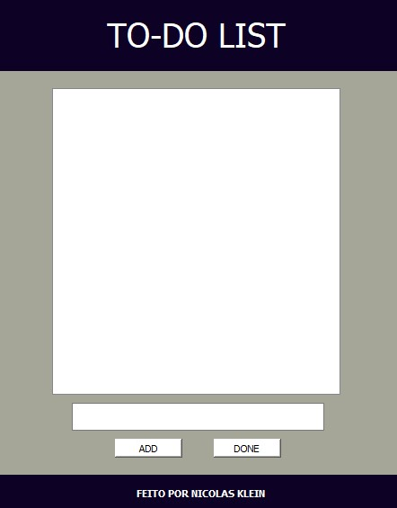

# To-do List with Python
  .

# About
 This is a to-do list app made with Python.
 The graphical interface was made using the library "PyQT" and the data saving was done using the "Pandas" in a ".csv" file.
 The to-do list helps you to schedule everyday tasks.

# Used Tecnologies
 ### Back-end
 - Python
 - Pandas

 ### Front-end
 - Python
 - PyQT

# How to execute the project
 Download the ".zip" file in the link below.  
 Download link: [todolist-app.zip](./assets/download/todolist-app.zip)  
 Execute the ".exe" file in the same folder as the ".csv" file.

# Author
 Nicolas Klein Faria de Araujo  
 https://nicolaskleinaraujo.github.io/portfolio/src/
